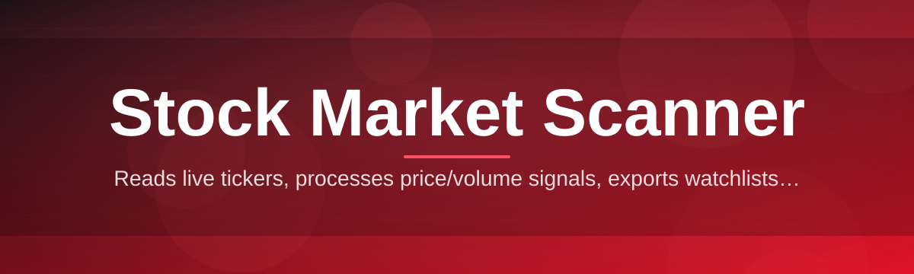
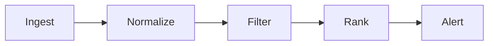

# stock-market-scanner-tool 📈🔎

  

*A desktop-grade stock market scanner that filters the noise so you can find the setup, not the haystack.*

  

## 🌱 Overview

Every trading desk has that one spreadsheet — the one someone built at 2 AM because the "professional" platform they paid for still couldn't surface a simple breakout scan fast enough. **stock-market-scanner-tool** grew out of that exact frustration. What started as a personal utility for filtering equities by volume spikes and relative strength has turned into a full-blown, community-maintained stock market scanner that thousands of traders, students, and quant-curious tinkerers now rely on daily.

At its core, this project answers one question really well: *out of thousands of tickers, which ones actually deserve your attention right now?* Instead of scrolling through ticker tape or juggling six browser tabs, you get a single native Windows application that scans, ranks, and visualizes market movers, gappers, and technical setups in real time. Whether you're screening for momentum breakouts, unusual volume, oversold reversals, or sector rotation plays, the scanner engine is built to be fast, transparent, and endlessly configurable.

This tool is for **discretionary traders** who want a sharper edge, **students** learning technical analysis without paying for a bloated suite, and **developers** who enjoy tinkering with market data pipelines and want a solid open-source foundation to extend. It is not a broker, not a signal service, and not a promise of profit — it's an instrument, and like any instrument, it's only as good as the hands using it.

---

## ⚡ What It Actually Does

The scanner isn't a single feature — it's a stack of small, sharp tools that work together. Here's the rundown:

- **Real-time market breadth scanning** — continuously sweeps the exchange for volume anomalies, gap-ups, gap-downs, and momentum shifts, refreshing on a configurable interval so you're never staring at stale data.

- **Custom filter builder** — chain together conditions like price range, average volume, float size, RSI thresholds, and moving-average crossovers using a visual, no-code filter stack.

- **Watchlist intelligence** — save curated ticker lists that auto-refresh with live scanner metrics, so your "core 40" stocks are always ranked by whatever criteria matters to you that day.

- **Heatmap visualization** — a color-coded sector and market-cap heatmap that turns a wall of tickers into something you can read in three seconds.

- **Alert engine** — desktop notifications when a stock crosses your defined thresholds, so the scanner works even when you're not staring at it.

- **Historical replay mode** — rewind the scanner's state to a prior session to study how a setup developed before it triggered — genuinely useful for backtesting instincts, not just algorithms.

- **Exportable scan results** — push any scan output to CSV for further analysis in your spreadsheet or research pipeline of choice.

- **Multi-monitor friendly layout** — dockable panels so the scanner can live on a secondary screen without eating your primary workspace.

> [!TIP]
> Combine the **filter builder** with **watchlist intelligence** to build a "morning routine" scan that runs automatically the moment you open the app.

---

## 🚀 Getting Started

Getting the stock market scanner running takes minutes, not an afternoon:

1. **Visit the landing page** using the download button above — this always points to the current, verified build.

2. **Download the installer** for Windows 10/11 (x64). No package managers, no dependency chains, no fuss.

3. **Run the executable.** Windows SmartScreen may flag it as unrecognized on first launch — click *More Info → Run Anyway*. This is standard for indie-built, unsigned installers.

4. **Load a watchlist or run your first scan** using one of the built-in presets (Gappers, High-Relative-Volume, or 52-Week Breakouts) to see the engine in action immediately.

> [!NOTE]
> First launch performs a one-time local cache initialization. This can take 10–20 seconds depending on disk speed — it is not frozen, just warming up.

---

## 🖥️ System Requirements

| Component | Minimum | Recommended |
|---|---|---|
| OS | Windows 10 (64-bit) | Windows 11 (64-bit) |
| RAM | 4 GB | 8 GB+ |
| Storage | 250 MB free | 1 GB free (for historical cache) |
| Display | 1366×768 | 1920×1080 or multi-monitor |
| Internet | Required for live data | Stable broadband recommended |

- Fully **standalone** — no runtime installs, no external interpreters required.

- No third-party dependency management needed; everything ships inside the installer.

- Works cleanly on both physical machines and virtual desktops (VDI setups tested by the community).

---

## 🧩 How It Works

Under the hood, the scanner follows a deliberately simple pipeline — simple things break less, and traders don't have patience for a fragile tool during market hours.

1. **Ingest** — market data streams in from configured sources at your chosen refresh interval.

2. **Normalize** — ticks and quotes are cleaned, deduplicated, and aligned into a consistent internal schema.

3. **Filter** — your active scan criteria run against the normalized dataset in-memory for speed.

4. **Rank & Render** — matching tickers are scored, sorted, and pushed to the UI layer, heatmap, and alert engine simultaneously.

5. **Act** — you review, add to a watchlist, export, or set a follow-up alert.

> [!IMPORTANT]
> The scanner surfaces candidates based on your criteria — it does not interpret intent. Always apply your own judgment before acting on any scan result.

---

## 🛟 Troubleshooting

<strong>The scanner shows "No Data" for every ticker.</strong>

This almost always means your internet connection dropped mid-session, or the data source is temporarily rate-limiting requests. Restart the scan loop from the toolbar — it reconnects automatically within a few seconds.

<strong>Windows says the app is from an "unknown publisher."</strong>

That's expected for an independently distributed tool without a paid code-signing certificate. The binary is built transparently from this repository's source — check the release notes on the landing page if you want to verify build details.

<strong>My custom filter isn't returning any results.</strong>

Double-check for overly narrow ranges — a common mistake is stacking a tight float filter with a tight volume filter, which can eliminate every ticker in a quiet session. Loosen one condition at a time to isolate the culprit.

<strong>The heatmap looks frozen.</strong>

The heatmap only redraws on new qualifying data. During low-volatility periods, that can look static — it's accurate, just calm. Check the refresh timestamp in the corner to confirm it's live.

<strong>Alerts aren't popping up on my second monitor.</strong>

Windows notification routing sometimes defaults to the primary display. Check Settings → Notifications → Display Target inside the app and pin it to the correct monitor.

---

## 🎨 UI / UX Details

The interface is built for people who stare at screens for hours — small comfort details add up.

- **Themes:** Dark (default), Light, and a high-contrast "Terminal Green" mode for that classic trading-floor feel.

- **Keyboard shortcuts:**

  | Action | Shortcut |
  |---|---|
  | New scan | `Ctrl + N` |
  | Refresh scan | `F5` |
  | Toggle heatmap | `Ctrl + H` |
  | Save watchlist | `Ctrl + S` |
  | Open filter builder | `Ctrl + F` |
  | Toggle theme | `Ctrl + T` |

- **Settings** persist locally per-user, so your filter presets and theme choice survive updates.

- **Dockable panels** let you rearrange the watchlist, heatmap, and scan results into whatever layout matches your monitor setup.

> [!WARNING]
> Resetting settings via *Preferences → Restore Defaults* clears saved filter presets. Export them first if you've invested time tuning a custom scan.

---

## 🤝 Contributing & Community

This project runs on the same energy that started it — curiosity and a refusal to accept clunky tools. Contributions of every size are welcome, and we mean that.

- Check the **good-first-issue** label if you're new — these are scoped intentionally small so you can ship a real change on day one.

- Found a bug? Open an issue with steps to reproduce; screenshots of scan results are especially helpful.

- Have an idea for a new filter type or indicator? Start a discussion thread before writing code — it saves everyone rework.

- Documentation improvements, translation help, and UI polish PRs are just as valued as new features.

> [!TIP]
> New contributors: read the pinned "Architecture Overview" discussion before diving into the scanning engine — it'll save you a lot of guesswork.

  

---

## 📜 License

Released under the [MIT License](LICENSE), 2026. Use it, fork it, build your own scanner empire on top of it — just keep the license notice intact.

---

## ⚠️ Disclaimer

> This software is provided for informational and educational purposes only. It does not constitute financial advice, and nothing displayed within the scanner should be interpreted as a recommendation to buy, sell, or hold any security. Market data may be delayed or inaccurate due to third-party source limitations. Trading involves substantial risk of loss — always do your own research and consult a licensed financial professional before making investment decisions. The maintainers and contributors of this project assume no liability for financial outcomes resulting from its use.

